# Full Stack Library Management System | Angular 17, ASP.NET Core 6, MSSQLServerExpress

This is final project for the Coding Factory educational program in Software Development from OPA. The library management system is a solution for managing books, user accounts, and orders. The system includes features such as user registration,authentication and authorization, as well as book cataloging and ordering, user management with administrative capabilities, and additional functionalities like book returns and category management. 

Github repo: https://github.com/demitraps/library-management-system

## Tech Stack

**Front-end:** Angular 17 with Material Design components, TypeScript, Sass

**Back-end:** ASP.NET Core 6, Dapper ORM, JWT Authentication, MSSQLServerExpress

## Features

- Authentication system: Users can login and create accounts.
- JWT Authentication: User's data is stored in browser tokens.
- Role-based Authorization: Admin rights for specific sections, such as viewing the list of all users.
- Book and Category Management: Admin users can insert and delete books and categories.
- Enable/Block accounts
- Overdue fine: Users can see their fine for overdue book returns.

## Demo

## Screenshots

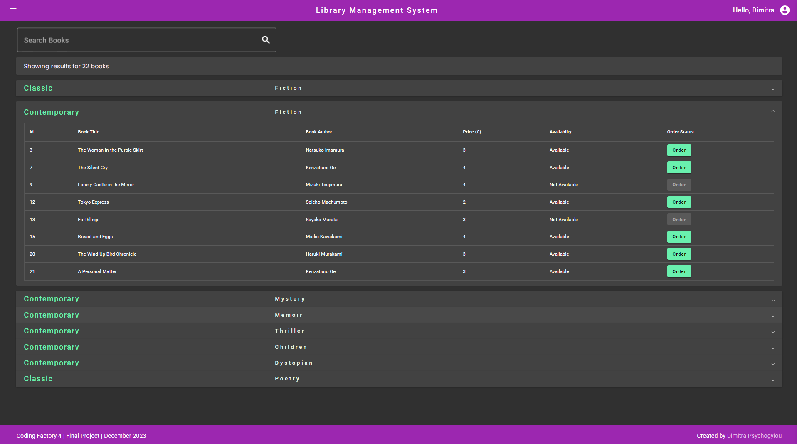
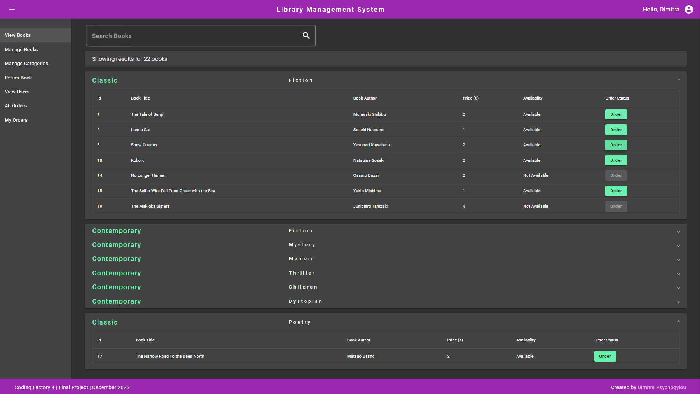
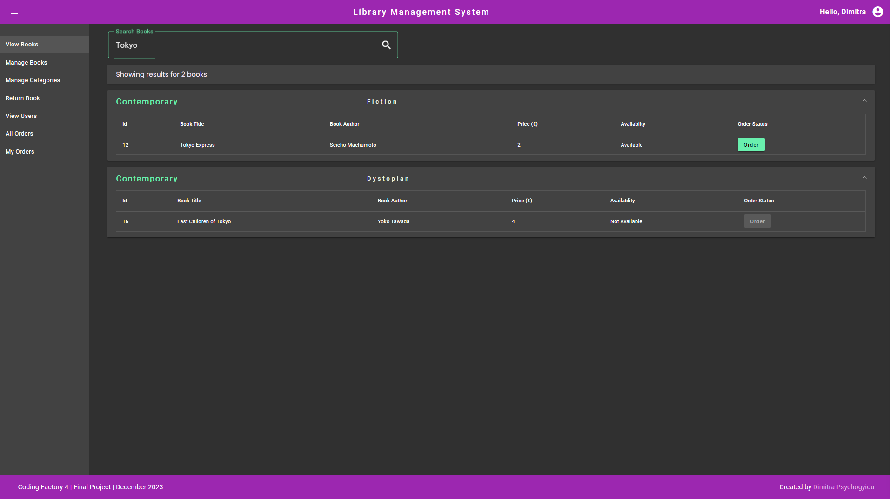
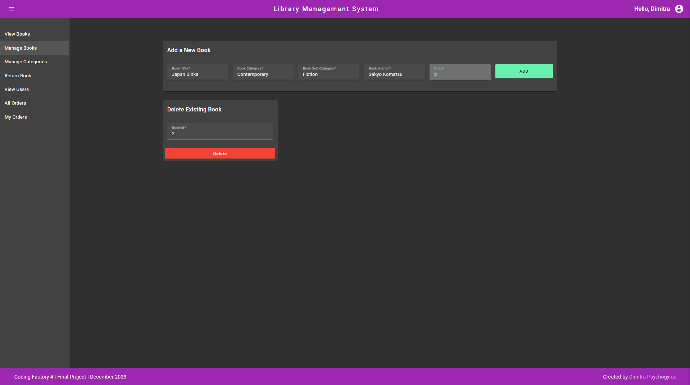
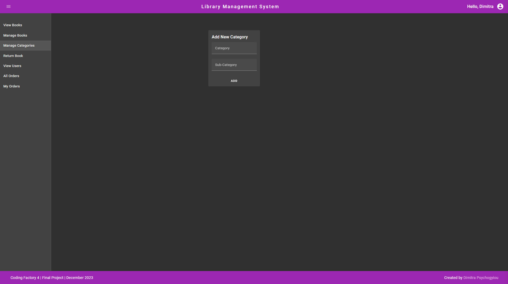
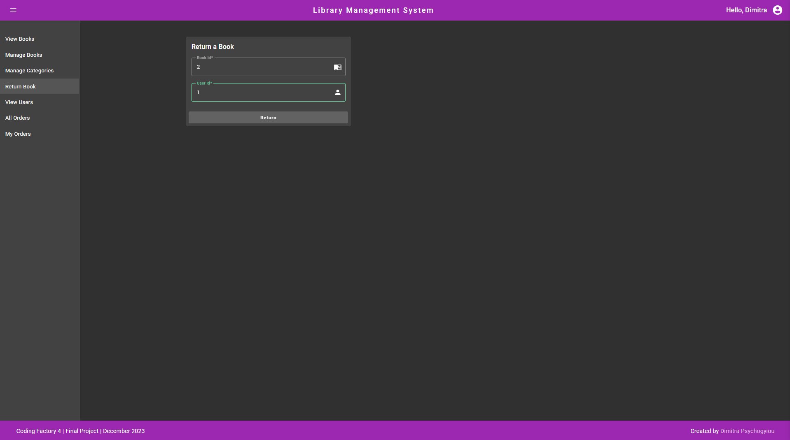
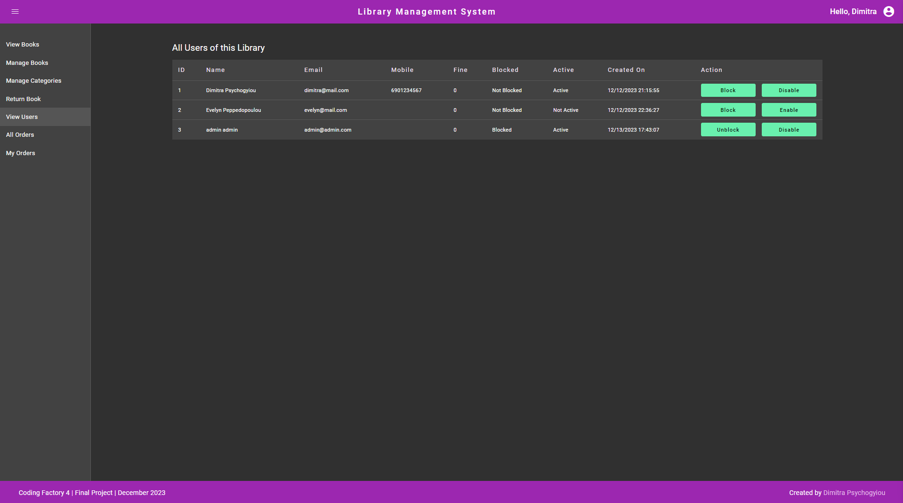
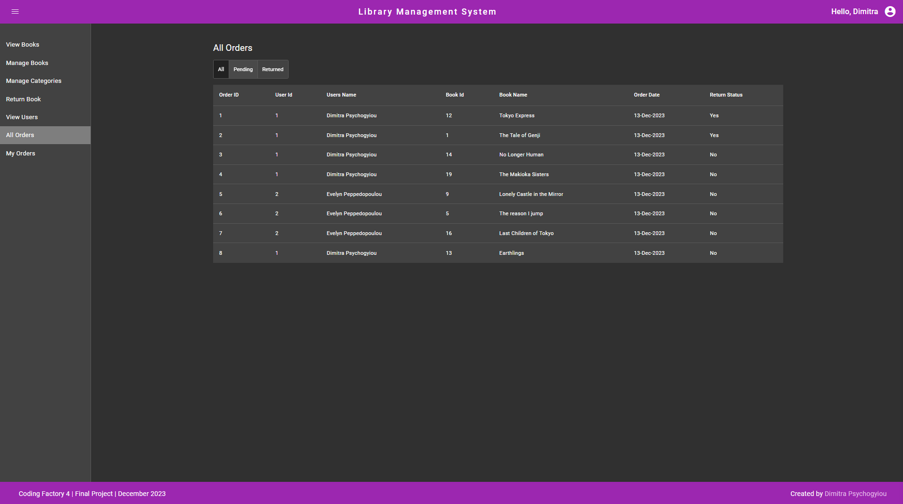
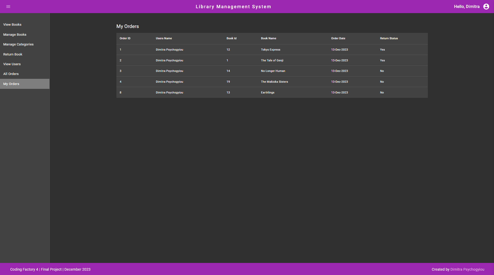
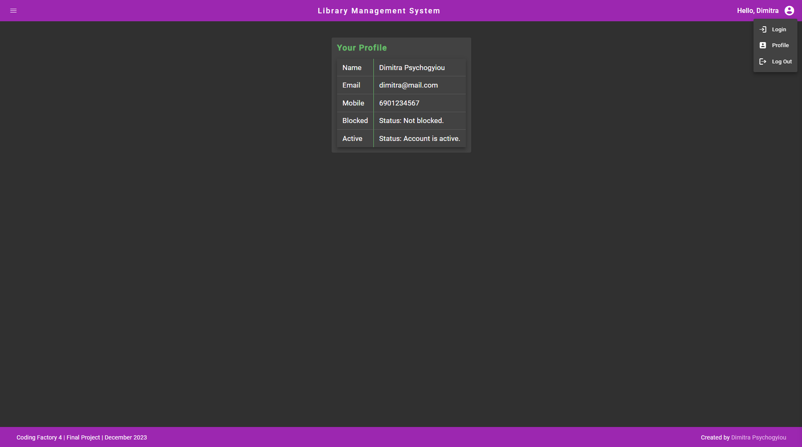
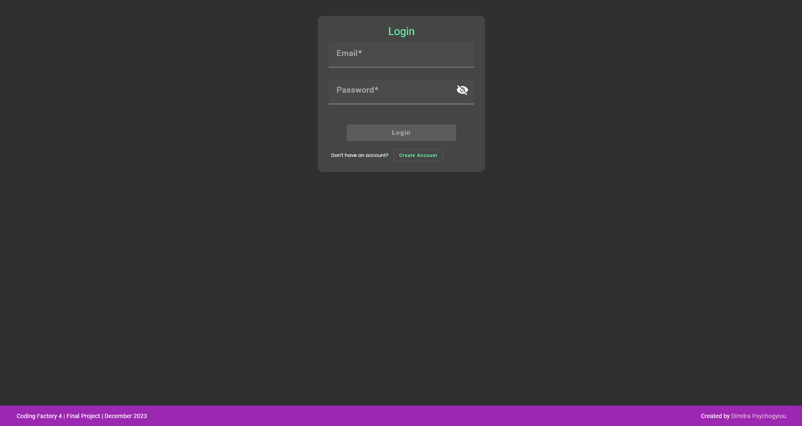
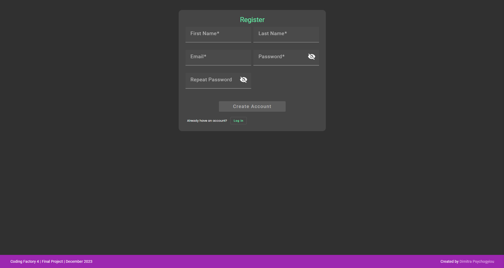

